# ECE 

**Major:** Cybersecurity International  
**Academic Year:** 5th year

---

**Course**  
*Linux Security*

**Lab Report**  
Lab 2 - Remote administration and dual-stack network filtering

**Instructor**  
Dr. Badre BOUSALEM

**Group Members**  
- ARDILLON Bastian
- PHAN Minh-Duc
- LANQUETIN Octave

**Date**  
September 23, 2026

---

## Table of Contents

- [1. Isolated experimental network](#sec1)
  - [1.1 Topology and environment](#sec1-1)
  - [1.2 Tools and addressing](#sec1-2)
  - [1.3 Connectivity and analysis](#sec1-3)
- [2. SSH trust and key-based authentication](#sec2)
  - [2.1 SSH service and accounts](#sec2-1)
  - [2.2 Host verification and key deployment](#sec2-2)
  - [2.3 Validation of key-based connections](#sec2-3)
- [3. SSH server access policy](#sec3)
  - [3.1 Configuration and syntax checks](#sec3-1)
  - [3.2 Policy validation and tests](#sec3-2)
  - [3.3 Analysis of the access policy](#sec3-3)
- [4. IPv4 and IPv6 filtering with nftables](#sec4)
  - [4.1 IPv4 and IPv6 rules](#sec4-1)
  - [4.2 Control traffic and expected results](#sec4-2)
- [5. Validation of filtering decisions](#sec5)
  - [5.1 Loading and checking rules](#sec5-1)
  - [5.2 Tests from permitted and denied sources](#sec5-2)
  - [5.3 Access recovery](#sec5-3)
- [6. Detection and automated response with Fail2ban](#sec6)
  - [6.1 Detection and ban parameters](#sec6-1)
  - [6.2 Interaction between network and SSH controls](#sec6-2)
- [7. Ban analysis and access restoration](#sec7)
  - [7.1 Triggering and observing the ban](#sec7-1)
  - [7.2 Verifying the block and restoring access](#sec7-2)
  - [7.3 Limitations analysis](#sec7-3)
- [8. Independent task on temporary access](#sec8)
  - [8.1 Strategy](#sec8-1)
  - [8.2 A1 — Maintenance access](#sec8-2)
  - [8.3 A2 — Validation matrix](#sec8-3)
  - [8.4 A3 — Revocation](#sec8-4)
- [9. Synthesis and environment restoration](#sec9)
  - [9.1 Conclusion](#sec9-1)
  - [9.2 Environment restoration](#sec9-2)
- [References](#ref)

---
<div style="page-break-after: always;"></div>

## Lab 2 - Remote administration and dual-stack network filtering

<a id="sec1"></a>

### 1. Isolated experimental network

<a id="sec1-1"></a>

#### 1.1 Topology and environment

**Environment used:** Oracle VirtualBox [version] on a Windows host. Two VMs, each with 2 vCPU, 2 GB RAM and a 15 GB disk [to confirm]. The client is a full clone of the server with regenerated MAC addresses, a new hostname and a new machine-id. A snapshot (`propre-avant-tp2`) was taken on both VMs before starting.

**Deviation from the prerequisites:** the VMs run **Ubuntu Server 26.04.1 LTS** (kernel `7.0.0-38-generic`, OpenSSH 10.2p1) instead of Ubuntu Server 24.04 LTS. The commands of the lab were applied unchanged; any difference in behaviour is reported in the relevant section.

**Console access:** the hypervisor console required by the lab is provided by the VirtualBox VM window and by a virtual serial port (COM1 as a host pipe, opened with PuTTY). Neither depends on SSH or on the network, so both remain usable when SSH or the firewall blocks access. No bridge and no inbound NAT port forwarding are configured.

| Role | VM | Hostname | Internal interface | MAC (Adapter 2) | IPv4 | IPv6 | NAT interface |
|---|---|---|---|---|---|---|---|
| Server | `LinuxSecurity-Lab02-Server` | `tp2-server` | `enp0s8` | `08:00:27:0c:f7:85` | `10.77.0.10/24` | `fd42:77::10/64` | `enp0s3` |
| Client | `LinuxSecurity-Lab02-Client` | `tp2-client` | `enp0s8` | `08:00:27:e1:df:d9` | `10.77.0.20/24` | `fd42:77::20/64` | `enp0s3` |

The internal interface was identified on each VM by matching the MAC address shown by VirtualBox for Adapter 2 (Internal Network `TP2-SEC`) with the `altname enx…` reported by `ip addr`. `enp0s3` carries the default route (`default via 10.0.2.2`) and was left untouched.

<a id="sec1-2"></a>

#### 1.2 Tools and addressing

```bash
sudo apt update
sudo apt install openssh-client netcat-openbsd iputils-ping
ssh -V
```

```bash
ip -br addr
ip route show default
read -r -p "Internal interface: " LAB_IF
read -r -p "Internal IPv4 address: " LAB_V4
read -r -p "Internal IPv6 address: " LAB_V6
sudo ip link set "$LAB_IF" up
sudo ip address add "$LAB_V4/24" dev "$LAB_IF"
sudo ip -6 address add "$LAB_V6/64" dev "$LAB_IF"
```

<table align="center">
  <tr>
    <td style="text-align:center">
      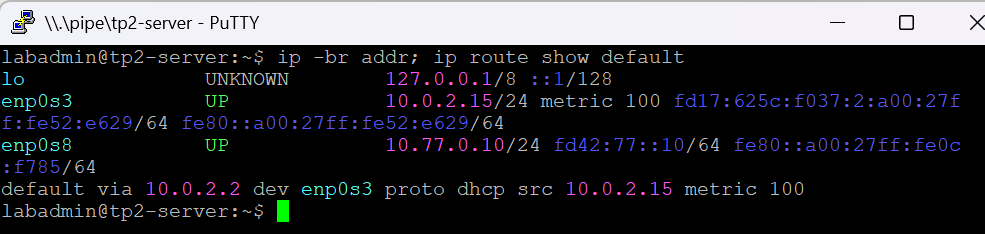<br>
      <em>Figure 1: Server — ip -br addr and default route</em>
    </td>
    <td style="text-align:center">
      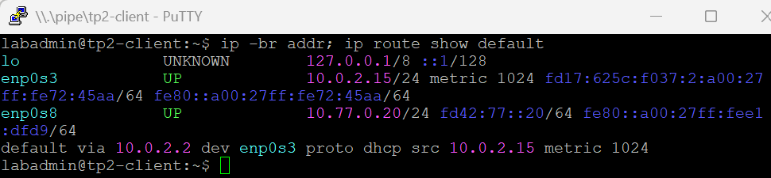<br>
      <em>Figure 2: Client — ip -br addr and default route</em>
    </td>
  </tr>
</table>

<a id="sec1-3"></a>

#### 1.3 Connectivity and analysis

```bash
ip -6 addr
ping -c 2 10.77.0.10
ping -6 -c 2 fd42:77::10
```

<div align="center">
  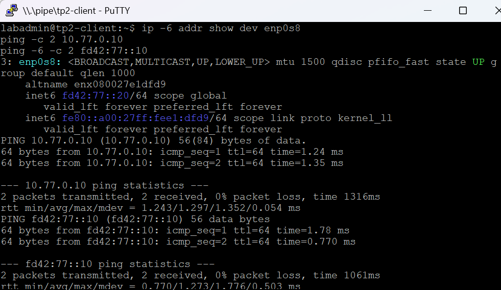
  <p><em>Figure 3: IPv6 addresses no longer tentative, IPv4 and IPv6 ping tests from the client</em></p>
</div>

<div align="center">
  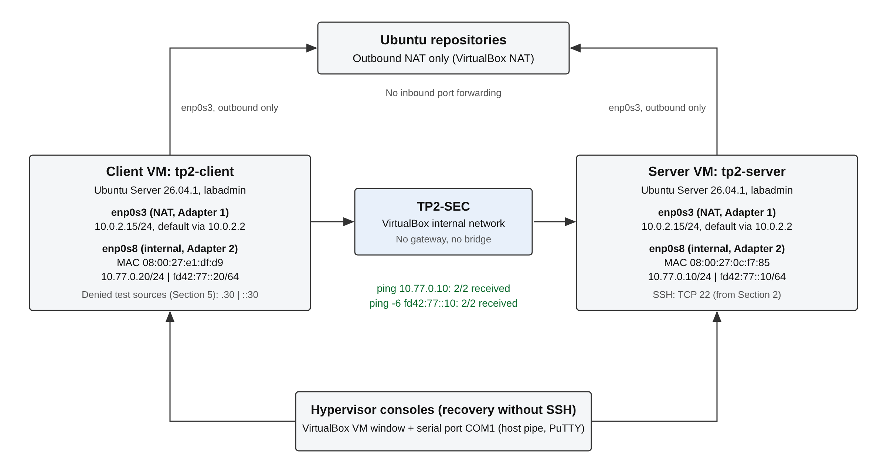
  <p><em>Figure 4: Annotated lab topology with actual interface names</em></p>
</div>

> **Humain Review Needed : Claude donne ça, mais pas sûr de le mettre**

The lab IPv6 address is no longer `tentative` and shows no `dadfailed`, so duplicate address detection is complete. Both pings from the client succeed with 0% packet loss. The replies come back with `ttl=64`, which shows that no router sits between the two VMs: they are on the same link, as expected on an internal network without a gateway.

<div style="page-break-after: always;"></div>

**Q1 — Answer**

*[Purpose of outbound NAT]*

*[Why there is no internal gateway on TP2-SEC]*

*[Recovery method if SSH becomes inaccessible (hypervisor console)]*

**P1 — Evidence**

| Test | Command | Result | Consistent with expectations? |
|---|---|---|---|
| Server internal address | `ip -br addr` (server) | `enp0s8 UP 10.77.0.10/24 fd42:77::10/64` | Yes |
| Client internal address | `ip -br addr` (client) | `enp0s8 UP 10.77.0.20/24 fd42:77::20/64` | Yes |
| DAD completed | `ip -6 addr show dev enp0s8` | `fd42:77::20/64 scope global`, no `tentative`, no `dadfailed` | Yes |
| IPv4 ping | `ping -c 2 10.77.0.10` | 2 transmitted, 2 received, 0% loss, `ttl=64` | Yes |
| IPv6 ping | `ping -6 -c 2 fd42:77::10` | 2 transmitted, 2 received, 0% loss, `ttl=64` | Yes |

---
<div style="page-break-after: always;"></div>

<a id="sec2"></a>

### 2. SSH trust and key-based authentication

<a id="sec2-1"></a>

#### 2.1 SSH service and accounts

```bash
sudo apt install openssh-server nftables fail2ban python3-systemd
sudo systemctl disable --now fail2ban ssh.socket
sudo systemctl enable --now ssh.service
sudo nft list ruleset
sudo ufw status
```

```bash
sudo addgroup sshadmin
sudo adduser tpadmin
sudo adduser tpexterne
sudo usermod -aG sshadmin tpadmin
sudo ssh-keygen -lf /etc/ssh/ssh_host_ed25519_key.pub -E sha256
```

<div align="center">
  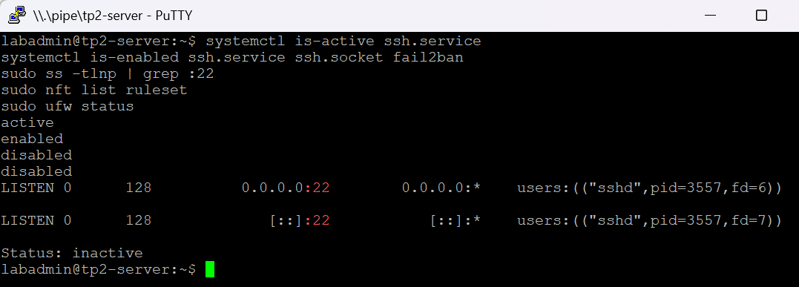
  <p><em>Figure 5: SSH service enabled, empty ruleset, UFW inactive</em></p>
</div>

<div align="center">
  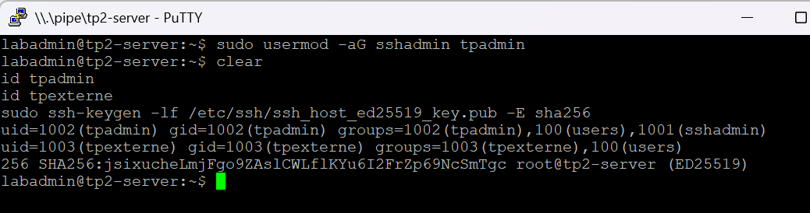
  <p><em>Figure 6: Accounts and sshadmin group created, server host key fingerprint at the console</em></p>
</div>

On the server, `ssh.service` is active and enabled, while `ssh.socket` and `fail2ban` are disabled: SSH runs as a permanent service and Fail2ban stays stopped until Section 6. `sshd` listens on TCP 22 on all addresses, in IPv4 (`0.0.0.0:22`) and IPv6 (`[::]:22`). `nft list ruleset` returns nothing and UFW is inactive, so the server starts with no firewall rule: at this stage, nothing restricts which source can reach port 22.

| Account | Groups | Member of `sshadmin`? | sudo? |
|---|---|---|---|
| `tpadmin` | `tpadmin`, `users`, `sshadmin` | Yes | No |
| `tpexterne` | `tpexterne`, `users` | No | No |

Both test accounts were created with temporary passwords entered interactively. Only `tpadmin` belongs to the authorised group.

Server host key fingerprint, read at the console (reference value):

`256 SHA256:jsixucheLmjFgo9ZAslCWLflKYu6I2FrZp69NcSmTgc root@tp2-server (ED25519)`

<a id="sec2-2"></a>

#### 2.2 Host verification and key deployment

```bash
install -d -m 700 ~/.ssh
ssh-keygen -t ed25519 -a 64 -f ~/.ssh/id_ed25519_tp2
ssh-copy-id -i ~/.ssh/id_ed25519_tp2.pub \
  -o HostKeyAlgorithms=ssh-ed25519 tpadmin@10.77.0.10
ssh-copy-id -i ~/.ssh/id_ed25519_tp2.pub \
  -o HostKeyAlgorithms=ssh-ed25519 tpexterne@10.77.0.10
```

<div align="center">
  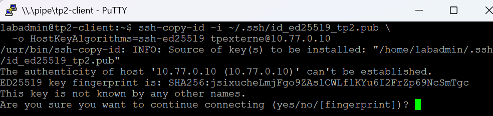
  <p><em>Figure 7: Fingerprint presented on first connection, compared with the console value</em></p>
</div>

<div align="center">
  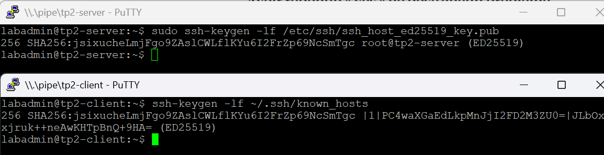
  <p><em>Figure X: Host key fingerprint read at the server console (top) and the entry recorded in the client's known_hosts (bottom): both values are identical</em></p>
</div>

> **Humain Review Needed : Claude donne ça, mais pas sûr de le mettre**

A new ED25519 key pair was generated on the client, protected by a passphrase, in a file that did not exist before (`~/.ssh/id_ed25519_tp2`). Only the public key (`.pub`) was sent to the server, with `ssh-copy-id`, for both `tpadmin` and `tpexterne`. The private key never left the client.

On the first connection (`tpexterne@10.77.0.10`), the client displayed the server's ED25519 fingerprint and asked for confirmation. We compared it with the value read at the server console before accepting. We then checked the entry stored in the client's `known_hosts` against the server's host key: both give the same fingerprint. The second `ssh-copy-id` (`tpadmin`) did not ask again, because the host was already known.

On the server, each account now has a `~/.ssh/authorized_keys` file that it owns, with mode 600.

<a id="sec2-3"></a>

#### 2.3 Validation of key-based connections

```bash
eval "$(ssh-agent -s)"
ssh-add ~/.ssh/id_ed25519_tp2
ssh -i ~/.ssh/id_ed25519_tp2 -o IdentitiesOnly=yes \
  tpadmin@10.77.0.10 id
ssh -6 -i ~/.ssh/id_ed25519_tp2 -o IdentitiesOnly=yes \
  -o HostKeyAlgorithms=ssh-ed25519 tpadmin@fd42:77::10 id
```

<div align="center">
  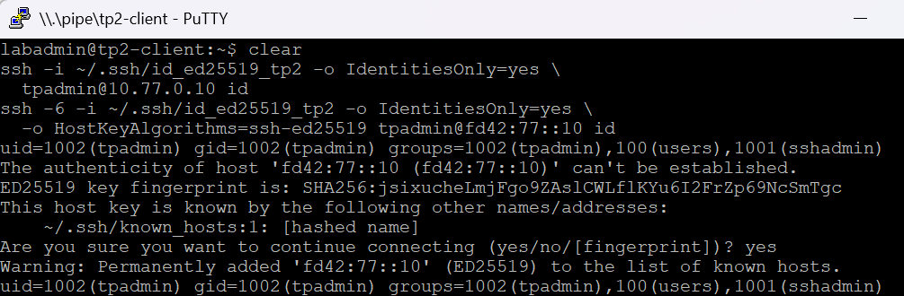
  <p><em>Figure 8: Key-based execution of id over IPv4 and IPv6</em></p>
</div>

The private key was loaded once into `ssh-agent`, so the passphrase is not asked again during the tests. Agent forwarding to the server is not enabled.

Both connections succeed with the key and without any password prompt: `id` runs on the server as `tpadmin`, a member of `sshadmin`. On the first IPv6 connection, the client asked for confirmation again, because `fd42:77::10` was a new name for it. It displayed the same fingerprint as the console value and indicated that this host key was already known under another address (`~/.ssh/known_hosts:1`). This confirms that both addresses lead to the same server.

<div style="page-break-after: always;"></div>

**Q2 — Answer**

*[Host key vs. user's public key vs. passphrase protecting the private key]*

*[Is a fingerprint received over the network sufficient to establish trust?]*

**P2 — Evidence**

| Test | Command | Result | Consistent with expectations? |
|---|---|---|---|
| Console fingerprint | `sudo ssh-keygen -lf /etc/ssh/ssh_host_ed25519_key.pub -E sha256` | `SHA256:jsixucheLmjFgo9ZAslCWLflKYu6I2FrZp69NcSmTgc` | Reference value |
| IPv4 first-connection fingerprint | `ssh-copy-id ... tpexterne@10.77.0.10` | `SHA256:jsixucheLmjFgo9ZAslCWLflKYu6I2FrZp69NcSmTgc` | Yes, identical |`SHA256:...` | |
| IPv6 first-connection fingerprint | `ssh -6 ... tpadmin@fd42:77::10 id` | `SHA256:jsixucheLmjFgo9ZAslCWLflKYu6I2FrZp69NcSmTgc` | Yes, identical |
| Key-based `id` over IPv4 | `ssh ... tpadmin@10.77.0.10 id` | `uid=1002(tpadmin) gid=1002(tpadmin) groups=1002(tpadmin),100(users),1001(sshadmin)` | Yes |
| Key-based `id` over IPv6 | `ssh -6 ... tpadmin@fd42:77::10 id` | `uid=1002(tpadmin) gid=1002(tpadmin) groups=1002(tpadmin),100(users),1001(sshadmin)` | Yes |

---
<div style="page-break-after: always;"></div>

<a id="sec3"></a>

### 3. SSH server access policy

<a id="sec3-1"></a>

#### 3.1 Configuration and syntax checks

```bash
sudo cp -a /etc/ssh /root/ssh.tp2.before
sudo grep -nE "^(Include|Match)" /etc/ssh/sshd_config
sudo ls -l /etc/ssh/sshd_config.d
sudo tee /etc/ssh/sshd_config.d/00-tp2.conf >/dev/null <<'EOF'
PubkeyAuthentication yes
PasswordAuthentication no
KbdInteractiveAuthentication no
AuthenticationMethods publickey
PermitRootLogin no
AllowGroups sshadmin
AllowAgentForwarding no
AllowTcpForwarding no
LogLevel VERBOSE
EOF
sudo /usr/sbin/sshd -t
sudo /usr/sbin/sshd -T -C \
  user=tpadmin,host=client,addr=10.77.0.20,laddr=10.77.0.10,lport=22
sudo /usr/sbin/sshd -T -C \
  user=tpadmin,host=client,addr=fd42:77::20,laddr=fd42:77::10,lport=22
sudo systemctl reload ssh.service
```

> **Humain Review Needed : Claude donne ça, mais pas sûr de le mettre**

The full output of `sshd -T -C` is more than one hundred lines long. For the screenshots, it was filtered with `grep -iE` to keep only the nine directives set in `00-tp2.conf`.

<div align="center">
  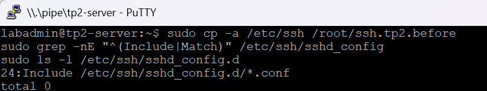
  <p><em>Figure 9: Included files, Match blocks and existing fragments in sshd_config.d</em></p>
</div>

<table align="center">
  <tr>
    <td style="text-align:center">
      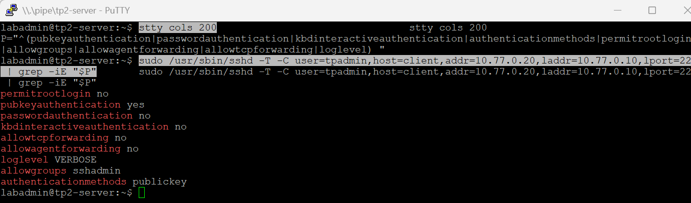<br>
      <em>Figure 10: Effective configuration (sshd -T -C) for an IPv4 connection</em>
    </td>
    <td style="text-align:center">
      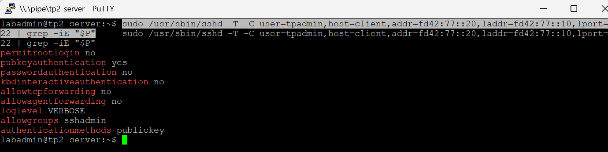<br>
      <em>Figure 11: Effective configuration (sshd -T -C) for an IPv6 connection</em>
    </td>
  </tr>
</table>

Before writing the policy, `/etc/ssh` was backed up to `/root/ssh.tp2.before`. The main file contains a single `Include /etc/ssh/sshd_config.d/*.conf` at line 24, near the top, and no `Match` block. The directory `sshd_config.d` was empty. There was therefore no earlier directive or conditional block that could conflict with our fragment, and nothing had to be corrected.

Because the `Include` line comes before the other directives of `sshd_config`, the values of `00-tp2.conf` are read first. For most directives, the first value obtained is the one that applies, so our fragment takes precedence over the defaults that follow.

`sshd -t` returned nothing, which means the syntax is valid. The effective configuration computed by `sshd -T -C` for `tpadmin` shows the nine expected values, and they are identical for an IPv4 and an IPv6 connection. The service was then reloaded and remained active.

<a id="sec3-2"></a>

#### 3.2 Policy validation and tests

```bash
# Legitimate accesses (new connections)
ssh -i ~/.ssh/id_ed25519_tp2 -o IdentitiesOnly=yes tpadmin@10.77.0.10 id
ssh -6 -i ~/.ssh/id_ed25519_tp2 -o IdentitiesOnly=yes tpadmin@fd42:77::10 id
# Negative controls
ssh -o PreferredAuthentications=password \
  -o PubkeyAuthentication=no tpadmin@10.77.0.10
ssh -o BatchMode=yes -i ~/.ssh/id_ed25519_tp2 \
  -o IdentitiesOnly=yes tpexterne@10.77.0.10
```

```bash
sudo journalctl -u ssh.service --since "-10 minutes" --utc --no-pager
id tpexterne
```

<div align="center">
  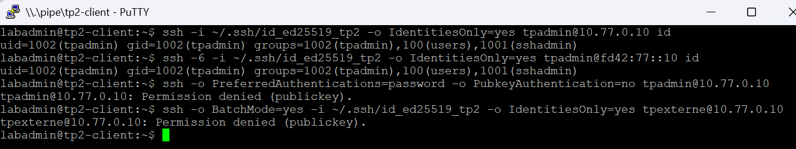
  <p><em>Figure 12: Two legitimate accesses and two negative controls from the client</em></p>
</div>

<div align="center">
  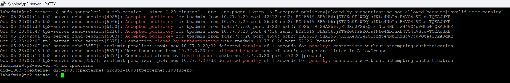
  <p><em>Figure 13: Server journal — password method refused, tpexterne not in AllowGroups</em></p>
</div>

For the screenshot, the journal was filtered with `grep -E` to keep the lines that show each decision. The unfiltered command is the one given in the lab.

The two legitimate accesses succeed over IPv4 and IPv6: the journal records `Accepted publickey for tpadmin` from `10.77.0.20` and from `fd42:77::20`.

**Password authentication.** The client receives `Permission denied (publickey)`: the list in brackets shows that the server only offers the `publickey` method. The journal shows `Connection closed by authenticating user tpadmin 10.77.0.20 [preauth]`. There is no "failed password" line, because the password method was never offered: the client had no permitted method left and closed the connection before authenticating. This rejection comes from `PasswordAuthentication no` and `AuthenticationMethods publickey`.

**Account outside the group.** `tpexterne` presents the same valid key and is also rejected. The client message is identical, but the journal gives a different reason: `User tpexterne from 10.77.0.20 not allowed because none of user's groups are listed in AllowGroups`. `id tpexterne` confirms that the account is not a member of `sshadmin`. This rejection comes from `AllowGroups sshadmin`, not from the key.

From the client, both rejections look the same. Only the server journal distinguishes a prohibited method from a missing group membership.

**Difference due to Ubuntu 26.04.** The journal also contains `srclimit_penalise ... deferred penalty of 1 seconds for penalty: connections without attempting authentication`. This is the `PerSourcePenalties` mechanism introduced in OpenSSH 9.8, which does not exist in the OpenSSH 9.6 of Ubuntu 24.04. `sshd` itself penalises a source address after failed or abandoned connections. It had no effect on these tests, but it is taken into account in Section 7.

No test was made with `root`: as the lab notes, a failed root connection without an installed key would not, on its own, demonstrate `PermitRootLogin no`. This directive is verified by the effective configuration in Section 3.1.

<div style="page-break-after: always;"></div>

<a id="sec3-3"></a>

#### 3.3 Analysis of the access policy

**Q3 — Answer**

*[What `sshd -t` demonstrates]*

*[What `sshd -T -C` demonstrates]*

*[What a real new connection demonstrates]*

*[Why keep tpexterne as a control with a valid key]*

**P3 — Evidence**

| Directive | Effective value (IPv4) | Effective value (IPv6) |
|---|---|---|
| `pubkeyauthentication` | `yes` | `yes` |
| `passwordauthentication` | `no` | `no` |
| `kbdinteractiveauthentication` | `no` | `no` |
| `authenticationmethods` | `publickey` | `publickey` |
| `permitrootlogin` | `no` | `no` |
| `allowgroups` | `sshadmin` | `sshadmin` |
| `allowagentforwarding` | `no` | `no` |
| `allowtcpforwarding` | `no` | `no` |
| `loglevel` | `VERBOSE` | `VERBOSE` |

| Test | Command | Result | Consistent with policy? |
|---|---|---|---|
| tpadmin, key, IPv4 | `ssh ... tpadmin@10.77.0.10 id` | Success: `uid=1002(tpadmin) ... 1001(sshadmin)` | Yes |
| tpadmin, key, IPv6 | `ssh -6 ... tpadmin@fd42:77::10 id` | Success: `uid=1002(tpadmin) ... 1001(sshadmin)` | Yes |
| tpadmin, password | `ssh -o PreferredAuthentications=password ...` | Rejected: `Permission denied (publickey)`, method not offered | Yes |
| tpexterne, valid key | `ssh -o BatchMode=yes ... tpexterne@10.77.0.10` | Rejected: `not allowed because none of user's groups are listed in AllowGroups` | Yes |

---
<div style="page-break-after: always;"></div>

<a id="sec4"></a>

### 4. IPv4 and IPv6 filtering with nftables

<a id="sec4-1"></a>

#### 4.1 IPv4 and IPv6 rules

**Server interfaces:** internal = `enp0s8` (MAC `08:00:27:0c:f7:85`), NAT = `enp0s3` (MAC `08:00:27:52:e6:29`)

```bash
LAB_IF=enp0s8
NAT_IF=enp0s3
ip link show dev "$LAB_IF"
ip link show dev "$NAT_IF"
```

<div align="center">
  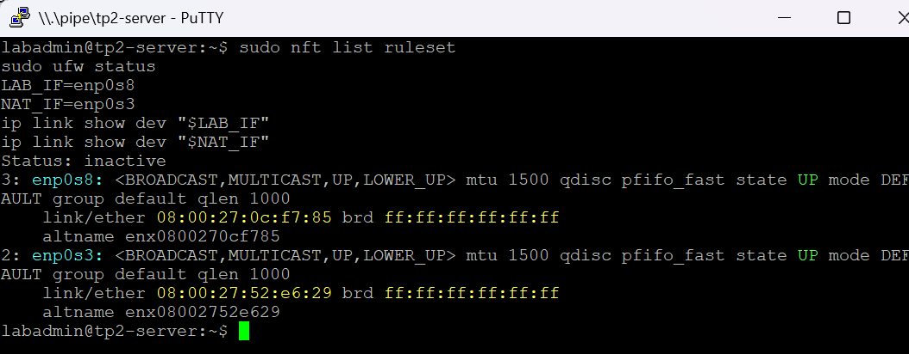
  <p><em>Figure X: Empty ruleset, UFW inactive, and the two server interfaces (internal enp0s8, NAT enp0s3)</em></p>
</div>

```bash
sudo install -d -m 755 /etc/nftables.d
sudo tee /etc/nftables.d/tp2.nft >/dev/null <<EOF
flush table inet tp2
table inet tp2 {
  chain input {
    type filter hook input priority 0; policy drop;
    iifname "lo" accept
    ct state invalid counter drop
    ct state established,related accept
    iifname "$NAT_IF" udp sport 67 udp dport 68 accept
    ip protocol icmp accept
    meta l4proto ipv6-icmp accept
    iifname "$LAB_IF" ip saddr 10.77.0.20 tcp dport 22 counter accept
    iifname "$LAB_IF" ip6 saddr fd42:77::20 tcp dport 22 counter accept
    counter drop
  }
  chain forward {
    type filter hook forward priority 0; policy drop;
  }
  chain output {
    type filter hook output priority 0; policy accept;
  }
}
EOF
```

<div align="center">
  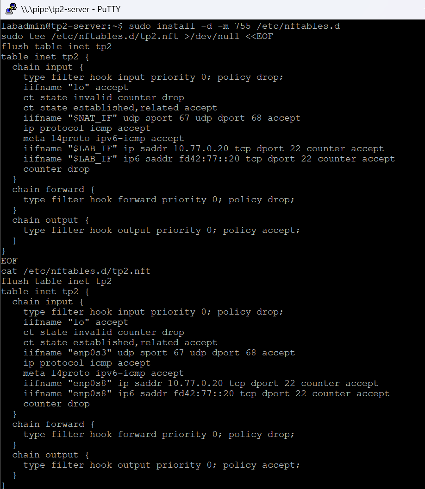
  <p><em>Figure 14: Empty ruleset, UFW inactive, interface names and generated tp2.nft</em></p>
</div>

> **Humain Review Needed : Claude donne ça, mais pas sûr de le mettre**

Before writing the rules, `nft list ruleset` returned nothing and UFW was inactive. The file manages only the lab table `tp2`: it starts with `flush table inet tp2`, so reloading it never touches any other table. The `inet` family applies the same chain to IPv4 and IPv6.

The `input` chain has a default policy of `drop`, and its rules are evaluated in order:

| Rule | Purpose |
|---|---|
| `iifname "lo" accept` | Local traffic of the server itself |
| `ct state invalid counter drop` | Packets that belong to no valid connection |
| `ct state established,related accept` | Replies to connections the server opened (for example `apt update`), and packets of sessions already accepted |
| `iifname "enp0s3" udp sport 67 udp dport 68 accept` | DHCPv4 renewal on the NAT interface |
| `ip protocol icmp accept` | IPv4 control messages (ping, errors) |
| `meta l4proto ipv6-icmp accept` | All ICMPv6, which IPv6 needs to work |
| `iifname "enp0s8" ip saddr 10.77.0.20 tcp dport 22 counter accept` | SSH from the administration workstation, IPv4 |
| `iifname "enp0s8" ip6 saddr fd42:77::20 tcp dport 22 counter accept` | SSH from the administration workstation, IPv6 |
| `counter drop` | Everything else, counted |

The `forward` chain drops everything, because the server is not a router. The `output` chain accepts everything: only incoming traffic is filtered. At this stage the file is only written to disk; it is loaded in Section 5.

<a id="sec4-2"></a>

#### 4.2 Control traffic and expected results

**Q4 — Answer**

Connections to TCP 22 from `10.77.0.20` and `fd42:77::20` will be accepted. Each of these two addresses matches one of the SSH rules, which name the internal interface `enp0s8`, one exact source address and destination port 22.

Connections from `10.77.0.30` and `fd42:77::30` will be blocked. No `accept` rule matches them, because the two SSH rules only authorise `10.77.0.20` and `fd42:77::20`. The packet therefore goes down to the last line of the chain, `counter drop`, which blocks it and counts it. Even without that line, the default `policy drop` would have the same effect. The filter follows a default-deny logic: what is not explicitly accepted is refused.

`drop` means that the server discards the packet without replying. The client will not receive an immediate refusal: it will wait until its timer expires. We therefore expect a timeout for `.30` and `::30`, not a "connection refused".

A blanket block on ICMPv6 would break IPv6 itself, even with TCP 22 permitted. IPv6 has no ARP: a host finds the MAC address of its neighbour with Neighbour Discovery, which is carried by ICMPv6. If the server dropped all ICMPv6, it would no longer answer the client's neighbour solicitation, and the client could not even send the first packet of the SSH connection. ICMPv6 also carries the "Packet Too Big" messages used to adjust packet size along the path; without them, a connection can open and then stall on large packets. This is why the lab accepts all ICMPv6.

---
<div style="page-break-after: always;"></div>

<a id="sec5"></a>

### 5. Validation of filtering decisions

<a id="sec5-1"></a>

#### 5.1 Loading and checking rules

```bash
sudo nft add table inet tp2
sudo nft -c -f /etc/nftables.d/tp2.nft
sudo nft -f /etc/nftables.d/tp2.nft
sudo nft list chain inet tp2 input
```

<div align="center">
  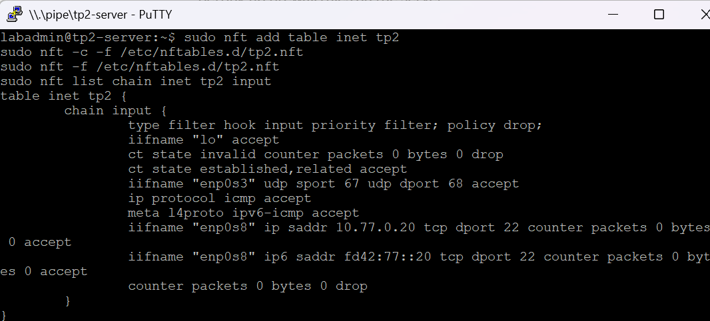
  <p><em>Figure 15: Ruleset validated, loaded, and input chain counters before the tests</em></p>
</div>

The table was created first, because the file begins with `flush table inet tp2`, which fails if the table does not exist. `nft -c -f` checked the file without applying it and returned nothing, so the file is valid. `nft -f` then loaded the rules. `nft flush ruleset` was never used.

The loaded `input` chain matches the file. `priority filter` is the name nftables displays for priority 0. Before the tests, the four counters are at zero: invalid packets, SSH from `10.77.0.20`, SSH from `fd42:77::20`, and the final `drop`.

<a id="sec5-2"></a>

#### 5.2 Tests from permitted and denied sources

```bash
LAB_IF=enp0s8
sudo ip address add 10.77.0.30/24 dev "$LAB_IF"
sudo ip -6 address add fd42:77::30/64 dev "$LAB_IF"
ip -6 addr show dev "$LAB_IF"
nc -4 -vz -w 3 -s 10.77.0.20 10.77.0.10 22
nc -4 -vz -w 3 -s 10.77.0.30 10.77.0.10 22
nc -6 -vz -w 3 -s fd42:77::20 fd42:77::10 22
nc -6 -vz -w 3 -s fd42:77::30 fd42:77::10 22
ssh -b 10.77.0.20 -i ~/.ssh/id_ed25519_tp2 \
  -o IdentitiesOnly=yes tpadmin@10.77.0.10 id
ssh -6 -b fd42:77::20 -i ~/.ssh/id_ed25519_tp2 \
  -o IdentitiesOnly=yes tpadmin@fd42:77::10 id
```

<div align="center">
  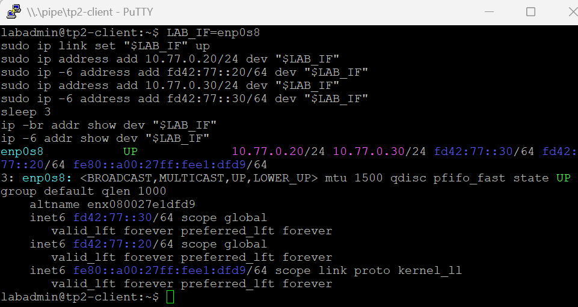
  <p><em>Figure X: Client internal interface with the permitted (.20, ::20) and denied (.30, ::30) source addresses, none tentative</em></p>
</div>

<div align="center">
  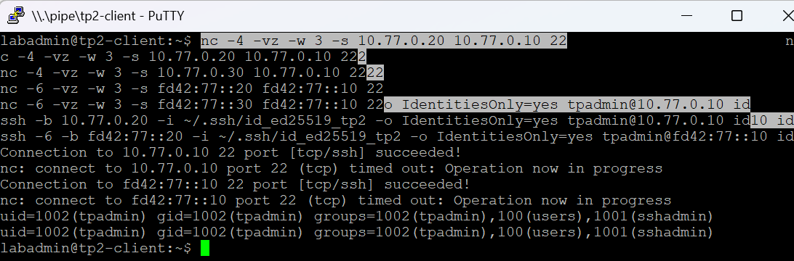
  <p><em>Figure 16: Four nc tests and two SSH identities from the client</em></p>
</div>

<table align="center">
  <tr>
    <td style="text-align:center">
      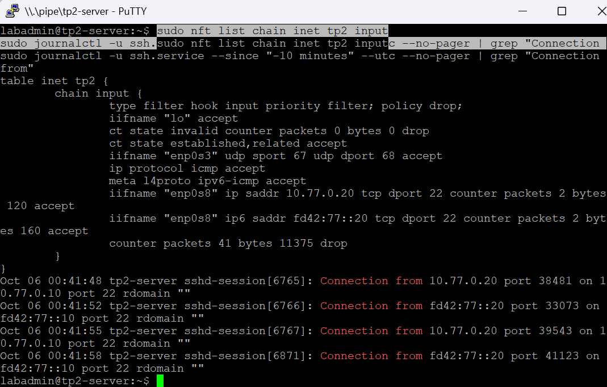<br>
      <em>Figure 17: Input chain counters after the tests</em>
    </td>
    <td style="text-align:center">
      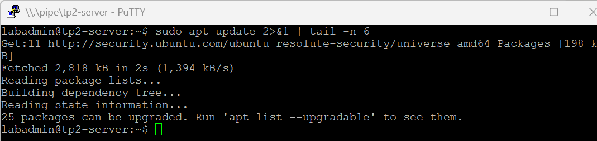<br>
      <em>Figure 18: Outbound NAT still working (sudo apt update)</em>
    </td>
  </tr>
</table>

> **Humain Review Needed : Claude donne ça, mais pas sûr de le mettre**

The client carries two extra source addresses on its internal interface, `10.77.0.30` and `fd42:77::30`. Each test binds explicitly to its source address (`-s` for `nc`, `-b` for `ssh`), so the same VM presents itself to the server either as the authorised workstation or as an unauthorised one.

The four results match the prediction of Q4. From `.20` and `::20`, the TCP connection to port 22 succeeds and `tpadmin` opens an SSH session. From `.30` and `::30`, `nc` times out after 3 seconds: the server sends no reply, which is the behaviour of `drop`.

On the server, two observations confirm where the decision was taken. The counters of the two SSH rules went from 0 to 2 packets each, one per new connection (`nc`, then `ssh`); the following packets of each connection are matched earlier by `ct state established,related accept` and are not counted there. The SSH journal contains four `Connection from` lines, all from `10.77.0.20` or `fd42:77::20`, and none from `.30` or `::30`: these packets were discarded by the filter before reaching `sshd`.

The final `drop` counter rose from 0 to 41 packets. It includes the attempts from `.30` and `::30`, but also every other refused packet since the table was loaded, so this number cannot be attributed to the tests alone.

`sudo apt update` still works with the filter active: replies to connections opened by the server are accepted as `established`.

**Incidents during this section.** The VMs had been paused overnight with VirtualBox "Save State". After resuming, the client froze (kernel `soft lockup` messages) and was rebooted; its temporary lab addresses were added again and the key was reloaded into a new `ssh-agent`. The server clock had not caught up after the pause (the first journal extract shows `00:41` UTC instead of about `14:11` UTC); it was corrected with `sudo chronyc makestep` before continuing. Neither incident changed the configuration under test.

<div style="page-break-after: always;"></div>

**Q5 — Answer**

*[Observation 1 — e.g. timeout vs. immediate SSH rejection on the client side]*

*[Observation 2 — e.g. nftables counters vs. sshd journal on the server side]*

**P4 — Evidence**

| Source | Command | TCP 22 result | Counter evolution | Consistent with policy? |
|---|---|---|---|---|
| `10.77.0.20` | `nc -4 -vz -w 3 -s 10.77.0.20 ...` | `succeeded!` | IPv4 SSH rule: 0 → 2 (with the `ssh` test below) | Yes |
| `10.77.0.30` | `nc -4 -vz -w 3 -s 10.77.0.30 ...` | `timed out` | Final `drop`: 0 → 41 (all refused traffic); no line in the SSH journal | Yes |
| `fd42:77::20` | `nc -6 -vz -w 3 -s fd42:77::20 ...` | `succeeded!` | IPv6 SSH rule: 0 → 2 (with the `ssh` test below) | Yes |
| `fd42:77::30` | `nc -6 -vz -w 3 -s fd42:77::30 ...` | `timed out` | Final `drop`: 0 → 41 (all refused traffic); no line in the SSH journal | Yes |
| SSH identity IPv4 | `ssh -b 10.77.0.20 ... id` | `uid=1002(tpadmin) ... 1001(sshadmin)` | Counted in the IPv4 SSH rule | Yes |
| SSH identity IPv6 | `ssh -6 -b fd42:77::20 ... id` | `uid=1002(tpadmin) ... 1001(sshadmin)` | Counted in the IPv6 SSH rule | Yes |
| Outbound NAT | `sudo apt update` | Fetched 2,818 kB, no error | Replies accepted as `established` | Yes |

<a id="sec5-3"></a>

#### 5.3 Access recovery

```bash
sudo nft delete table inet tp2
```

Recovery was not needed: the rules loaded without error and the legitimate accesses kept working. The command above was therefore not executed. If access had been lost, it would have been run from the serial console, which does not depend on the network; it removes only the lab table `tp2`.

---
<div style="page-break-after: always;"></div>

<a id="sec6"></a>

### 6. Detection and automated response with Fail2ban

<a id="sec6-1"></a>

#### 6.1 Detection and ban parameters

```bash
sudo tee /etc/fail2ban/jail.d/90-tp2.local >/dev/null <<'EOF'
[sshd]
enabled = true
backend = systemd
filter = sshd[mode=normal]
port = 22
banaction = nftables-multiport
findtime = 120
maxretry = 3
bantime = 180
ignoreip = 127.0.0.1/8 ::1
usedns = no
EOF
sudo fail2ban-client -t
sudo systemctl enable --now fail2ban
sudo fail2ban-client status sshd
sudo fail2ban-client get sshd journalmatch
```

<div align="center">
  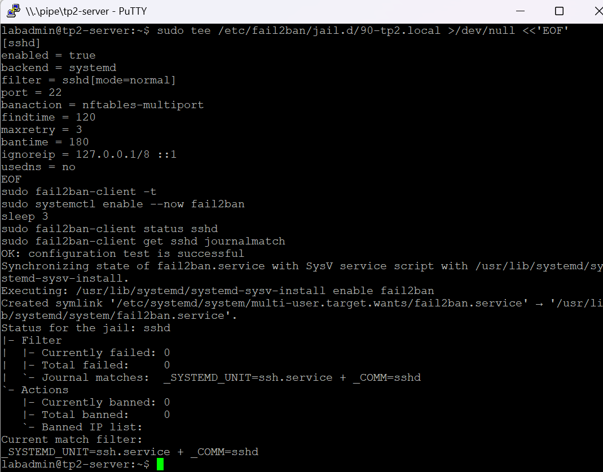
  <p><em>Figure 19: Fail2ban configuration test, sshd jail status and journalmatch</em></p>
</div>

```bash
sudo fail2ban-regex systemd-journal "sshd[mode=normal]" | tail -n 20
```

<div align="center">
  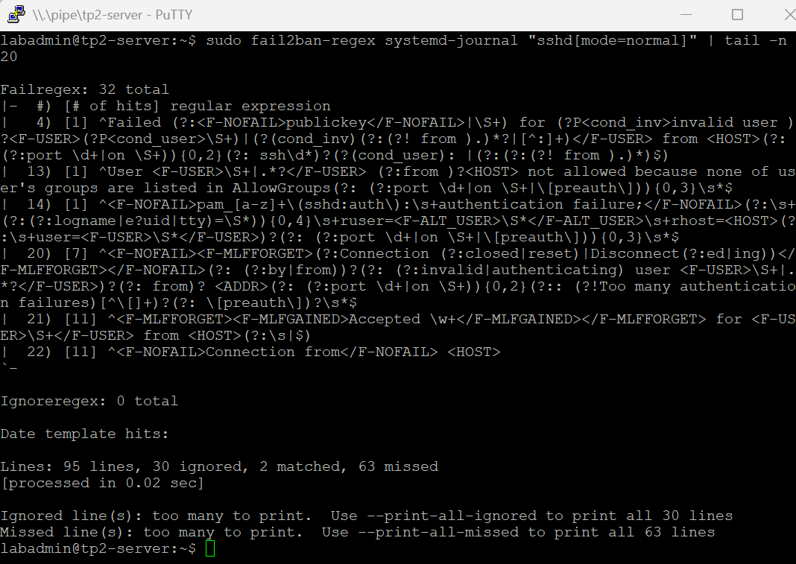
  <p><em>Figure X: fail2ban-regex on the existing journal — the sshd filter recognises the lines written by sshd-session (OpenSSH 10)</em></p>
</div>

The jail reads the systemd journal directly (`backend = systemd`), so no `logpath` is needed. Three failures (`maxretry = 3`) within 120 seconds (`findtime`) ban the source for 180 seconds (`bantime`), through an nftables action (`banaction = nftables-multiport`). `ignoreip` only lists the loopback addresses: the client address is deliberately not exempted.

`fail2ban-client -t` reports a valid configuration. After start-up, the `sshd` jail shows no failure and no banned address. The previous rejections (Section 3) were made the day before, far outside the 120-second window, so they cannot be confused with the next test.

**Check specific to Ubuntu 26.04.** With OpenSSH 10, authentication messages are logged by the process `sshd-session` instead of `sshd`. The effective journal match is `_SYSTEMD_UNIT=ssh.service + _COMM=sshd`, where `+` means "or": the first term selects every entry of `ssh.service`, including those written by `sshd-session`. Before triggering a ban, we ran `fail2ban-regex` on the existing journal. The filter matched the `AllowGroups` rejection of `tpexterne` from Section 3, which was logged by `sshd-session`. The packaged filter therefore handles the new log format, and the jail was used without modification.

<a id="sec6-2"></a>

#### 6.2 Interaction between network and SSH controls

<div align="center">
  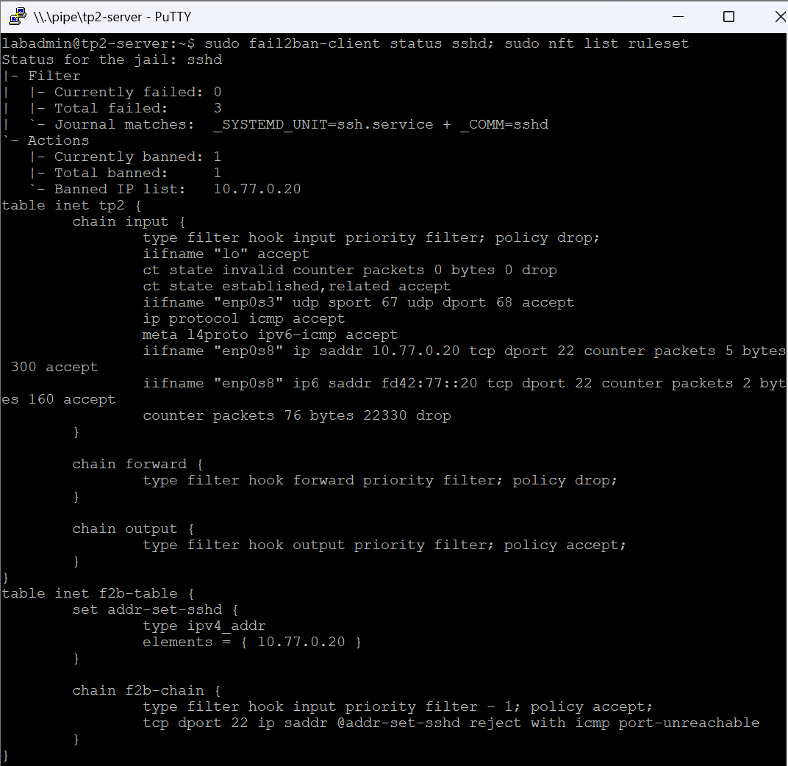
  <p><em>Figure 20: nft list ruleset — Fail2ban table and its actual priority compared to tp2</em></p>
</div>

The Fail2ban table did not exist before the first ban; it appeared when `10.77.0.20` was banned. `f2b-table` contains a set `addr-set-sshd` holding the banned address, and a chain `f2b-chain` attached to the same `input` hook as our chain, with priority `filter - 1`. Our `tp2` chain has priority `filter` (0). A lower value is evaluated first, so a new connection to TCP 22 meets Fail2ban's chain before ours.

Its rule is `tcp dport 22 ip saddr @addr-set-sshd reject with icmp port-unreachable`. For a banned address the packet is rejected there. The `accept` written in `tp2` for `10.77.0.20` cannot save it: an `accept` in one chain does not override a refusal imposed by another chain on the same hook. For a non-banned address, `f2b-chain` has `policy accept`, which only passes the packet on to the next chain, where `tp2` still applies its own rules.

Two details are visible in the ruleset. The set has type `ipv4_addr`, so the ban only concerns IPv4. The action is `reject`, not `drop`: the server answers the client, whereas `tp2` discards silently.

**Q6 — Answer**

*[Why a valid key cannot bypass a ban (network decision happens before sshd authentication, drop in one chain is final)]*

*[Why the client address must not be in ignoreip for this experiment]*

---
<div style="page-break-after: always;"></div>

<a id="sec7"></a>

### 7. Ban analysis and access restoration

<a id="sec7-1"></a>

#### 7.1 Triggering and observing the ban

```bash
# Server
getent passwd tp2inconnu
# Client (max 3 times, a few seconds apart)
ssh -b 10.77.0.20 -o BatchMode=yes -o ConnectTimeout=3 \
  -o IdentitiesOnly=yes -i ~/.ssh/id_ed25519_tp2 \
  tp2inconnu@10.77.0.10 true
# Server, after each attempt
sudo journalctl -u ssh.service --since "-3 minutes" \
  --utc --no-pager -o short-iso
sudo fail2ban-client status sshd
sudo nft list ruleset
```

<div align="center">
  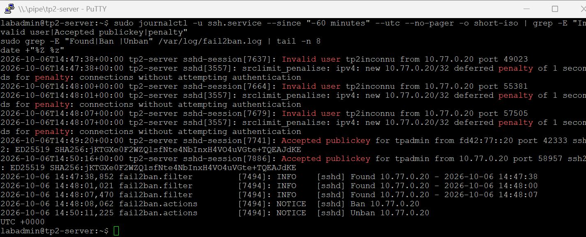
  <p><em>Figure 21: SSH journal events for tp2inconnu</em></p>
</div>

<div align="center">
  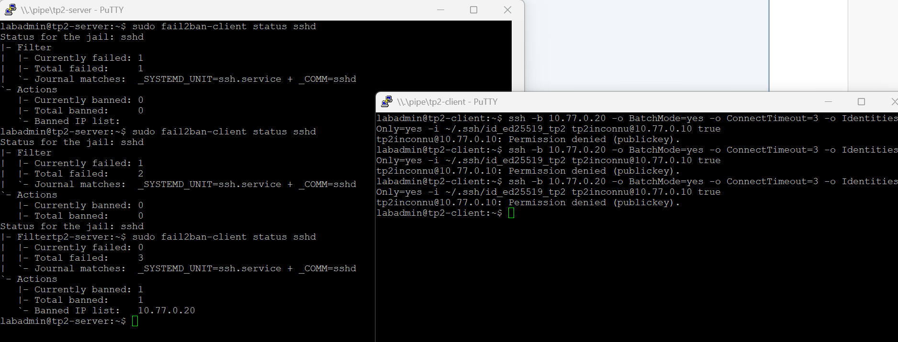
  <p><em>Figure 22: Fail2ban status with 10.77.0.20 banned, and the matching nftables set</em></p>
</div>

`getent passwd tp2inconnu` returned nothing (exit code 2): the account does not exist. Three attempts were made from `10.77.0.20`, a few seconds apart. Each one produced `Invalid user tp2inconnu from 10.77.0.20` in the SSH journal and a `Found 10.77.0.20` line in the Fail2ban log. The counter `Total failed` went 1, 2, 3, and the ban was applied one second after the third event, as configured (`maxretry = 3` within `findtime = 120`). No fourth attempt was made.

The journal also shows the OpenSSH 10 `PerSourcePenalties` mechanism (`srclimit_penalise`), with a penalty of 1 second per attempt. Three seconds in total is far below the level at which `sshd` itself refuses a source, so this mechanism played no part: the block observed next comes from Fail2ban, as the nftables set confirms.

<a id="sec7-2"></a>

#### 7.2 Verifying the block and restoring access

```bash
# Client — during the ban
ssh -b 10.77.0.20 -o BatchMode=yes -o ConnectTimeout=3 \
  -o IdentitiesOnly=yes -i ~/.ssh/id_ed25519_tp2 \
  tpadmin@10.77.0.10 id
ssh -6 -b fd42:77::20 -i ~/.ssh/id_ed25519_tp2 \
  -o IdentitiesOnly=yes tpadmin@fd42:77::10 id
# Server — lift the ban
sudo fail2ban-client set sshd unbanip 10.77.0.20
sudo fail2ban-client status sshd
```

<table align="center">
  <tr>
    <td style="text-align:center">
      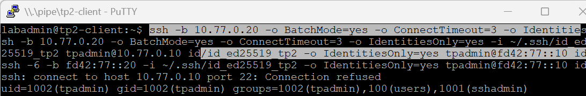<br>
      <em>Figure X: During the ban — tpadmin refused over IPv4, still accepted over IPv6</em>
    </td>
    <td style="text-align:center">
      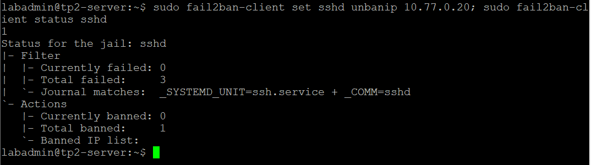<br>
      <em>Figure X: Server — ban lifted with unbanip, no address banned</em>
    </td>
  </tr>
  <tr>
    <td colspan="2" style="text-align:center">
      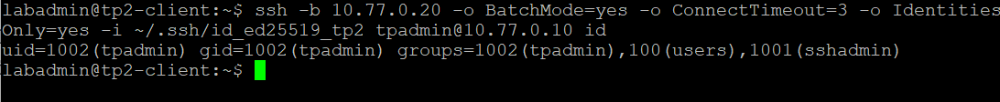<br>
      <em>Figure X: Client — tpadmin accepted again over IPv4 after the ban is lifted</em>
    </td>
  </tr>
</table>

During the ban, `tpadmin` was refused over IPv4 although its key is valid and its address is permitted by `tp2`: `ssh: connect to host 10.77.0.10 port 22: Connection refused`. The refusal is immediate, not a timeout, because Fail2ban's rule uses `reject`. The SSH journal contains no line for this attempt: it was stopped at network level, before authentication.

Over IPv6, bound to `fd42:77::20`, the same account was accepted during the ban (`Accepted publickey ... from fd42:77::20` at 14:49:20). The ban targets one IPv4 address; the IPv6 path of the same machine is unaffected.

`fail2ban-client set sshd unbanip 10.77.0.20` returned `1` (one address removed), 123 seconds after the ban, before the automatic expiry at 180 seconds. A new IPv4 connection then succeeded.

The ban appeared on the third attempt, so no further diagnosis was needed. The filter had been checked beforehand with `fail2ban-regex` (Section 6.1).

<div style="page-break-after: always;"></div>

<a id="sec7-3"></a>

#### 7.3 Limitations analysis

**Q7 — Answer**

*[Limitations when several users share a NAT address]*

*[Limitations when an authorised source is compromised]*

*[Does Fail2ban's active status alone demonstrate the observed behaviour?]*

**P5 — Evidence (timeline)**

| Time (UTC) | Event | Counter / banned address | Observation |
|---|---|---|---|
| 14:47:38 | Attempt 1 — `tp2inconnu` from `.20` | Total failed: 1, banned: 0 | `Invalid user tp2inconnu`; Fail2ban `Found` |
| 14:48:00 | Attempt 2 — `tp2inconnu` from `.20` | Total failed: 2, banned: 0 | `Invalid user tp2inconnu`; Fail2ban `Found` |
| 14:48:07 | Attempt 3 — `tp2inconnu` from `.20` | Total failed: 3 | `Invalid user tp2inconnu`; Fail2ban `Found` |
| 14:48:08 | Ban applied | `10.77.0.20` | `Ban 10.77.0.20`; address added to `addr-set-sshd` |
| between 14:48:08 and 14:49:20 | `tpadmin` from `.20` (IPv4) | Banned: 1 | `Connection refused` on the client; no line in the SSH journal |
| 14:49:20 | `tpadmin` from `::20` (IPv6) | Banned: 1 | `Accepted publickey`, IPv6 access maintained |
| 14:50:11 | `unbanip 10.77.0.20` | Banned: 0 | `Unban 10.77.0.20`, 123 s after the ban |
| 14:50:16 | `tpadmin` from `.20` (IPv4) | Banned: 0 | `Accepted publickey`, access restored |

---
<div style="page-break-after: always;"></div>

<a id="sec8"></a>

### 8. Independent task on temporary access

<a id="sec8-1"></a>

#### 8.1 Strategy

The goal is to allow the maintenance workstation (10.77.0.21 / fd42:77::21) to reach SSH temporarily, without a new account, key or ban, while keeping tpadmin, its key and the SSH controls unchanged.

The chosen solution is two dedicated accept rules in the input chain of the tp2 table, one per IP family. Each one follows the pattern of the existing rules: internal interface enp0s8, one exact source address, TCP port 22. Both carry the comment tp2_maint, so they can be found with a single grep. They are inserted before the final counter drop, otherwise they would never be reached. Revocation is done by deleting each rule by its handle, which removes only these two rules and leaves the rest of the table untouched.

<a id="sec8-2"></a>

#### 8.2 A1 — Maintenance access

```bash
# Client — maintenance addresses
sudo ip address add 10.77.0.21/24 dev enp0s8
sudo ip -6 address add fd42:77::21/64 dev enp0s8

# Server — added SSH permissions
sudo nft insert rule inet tp2 input iifname "enp0s8" ip saddr 10.77.0.21 \
  tcp dport 22 accept comment "tp2_maint"
sudo nft insert rule inet tp2 input iifname "enp0s8" ip6 saddr fd42:77::21 \
  tcp dport 22 counter accept comment "tp2_maint"
sudo nft -a list chain inet tp2 input | grep tp2_maint

```

<div align="center">
  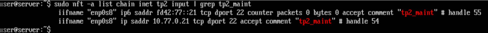
  <p><em>Figure 25: Modified rules in the input chain</em></p>
</div>

<div align="center">
  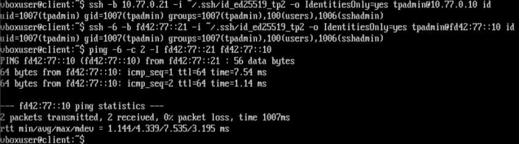
  <p><em>Figure 26: id over SSH from .21 and ::21 with the source explicitly bound</em></p>
</div>

The two rules appear in the chain with the tag tp2_maint and the handles 54 (IPv4) and 55 (IPv6). From the client, SSH sessions bound to 10.77.0.21 and to fd42:77::21 both succeed: id runs on the server as tpadmin, with the same key as before. A ping -6 -I fd42:77::21 to the server also succeeds (2 packets, 0% loss), so ICMPv6 remains operational. The default filtering is unchanged for the other sources: .30 and ::30 are still refused (see 8.3).

<a id="sec8-3"></a>

#### 8.3 A2 — Validation matrix

<div align="center"> 
  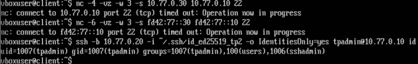 <p><em>Figure 27 : Denied and permitted sources during the maintenance window</em></p>
</div>

| Criterion | Source | Command | Expected | Observed | Verified by |
|---|---|---|---|---|---|
| A1 | `10.77.0.21` | `ssh -b 10.77.0.21 ... tpadmin@10.77.0.10 id` | Success | | |
| A1 | `fd42:77::21` | `ssh -6 -b fd42:77::21 ... tpadmin@fd42:77::10 id` | Success | | |
| A2 | `10.77.0.30` | `nc -4 -vz -w 3 -s 10.77.0.30 ...` | Timeout | | |
| A2 | `fd42:77::30` | `nc -6 -vz -w 3 -s fd42:77::30 ...` | Timeout | | |
| A2 | `10.77.0.20` | `ssh -b 10.77.0.20 ... id` | Success | | |

During the maintenance window, .21 and ::21 are accepted, .30 and ::30 are still silently dropped (timeout, no refusal), and .20 keeps its access. The temporary permission therefore does not widen access to any other source.

<a id="sec8-4"></a>

#### 8.4 A3 — Revocation

```bash
# Server — revocation of the maintenance permissions

```

<div align="center">
  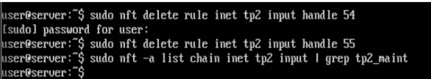
  <p><em>Figure 27: Revocation of the two maintenance rules by handle</em></p>
</div>

<div align="center"> 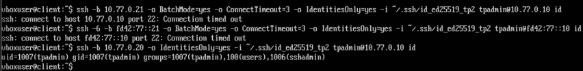 <p><em>Figure 28: After revocation — .21 and ::21 rejected, .20 still permitted</em></p> </div>

| Source | Command (new connection) | Expected | Observed |
|---|---|---|---|
| `10.77.0.21` | `nc -4 -vz -w 3 -s 10.77.0.21 ...` | Timeout | |
| `fd42:77::21` | `nc -6 -vz -w 3 -s fd42:77::21 ...` | Timeout | |
| `10.77.0.20` | `ssh -b 10.77.0.20 ... id` | Success | |

After the two deletions, the grep tp2_maint returns nothing: no maintenance rule is left in the chain. New connections from .21 and ::21 time out, as for any unauthorised source, and .20 still works.

Connection states matter here. The rule ct state established,related accept comes before the SSH rules, so an SSH session already opened from .21 before the revocation would not be cut by deleting the rule: its packets are matched as established. Only a new connection goes through the SSH rules again, which is why the revocation is proved with new connections, as done above. No session was left open during this test, so this behaviour was not observed directly.

---
<div style="page-break-after: always;"></div>

<a id="sec9"></a>

### 9. Conclusion

<a id="sec9-1"></a>

This lab aimed to secure remote administration of a server over a dual-stack (IPv4/IPv6) network by
combining several independent layers of control and checking each one with positive and negative
tests. We first established trust in the server by comparing its host key fingerprint with the console
value, then restricted access with an SSH policy based on keys and group membership. We then
added static IPv4/IPv6 filtering with nftables, and finally an event-driven response with Fail2ban.
Temporary maintenance access was added and revoked at the end. Each step was validated by new
connections, logs and counters, which showed that every layer takes its own decision: server trust,
account authorization, filtering by source address, and automated banning. One limitation remains: all
these controls rely on the source address and on established sessions, so a compromised authorized
source or an already open session is not stopped by them.

<a id="ref"></a>

### References

- [R1] Canonical — OpenSSH server: https://ubuntu.com/server/docs/how-to/security/openssh-server/
- [R2] OpenSSH `sshd_config` manual: https://man.openbsd.org/sshd_config
- [R5] nftables — A server policy: https://wiki.nftables.org/wiki-nftables/index.php/Simple_ruleset_for_a_server
- [R6] nftables — Chains and priorities: https://wiki.nftables.org/wiki-nftables/index.php/Configuring_chains
- [R7] Ubuntu 24.04 — Fail2ban `jail.conf` manual: https://manpages.ubuntu.com/manpages/noble/man5/jail.conf.5.html
- [R8] Fail2ban — nftables action: https://raw.githubusercontent.com/fail2ban/fail2ban/master/config/action.d/nftables.conf
- [R9] Ubuntu 24.04 — `fail2ban-client` manual: https://manpages.ubuntu.com/manpages/noble/man1/fail2ban-client.1.html

*[Add any other resource used for the independent task and explain how it was adapted]*

### AI usage statement

The commands, outputs and screenshots in this report come from our own work on the lab VMs. We used an AI assistant (**Claude Anthropic** / **ChatGPT**) as a tutor to understand the concepts (SSH host keys, effective sshd configuration, nftables chains and priorities, Fail2ban). We also used it to help draft the written answers (Q1–Q7), which we then reviewed, edited and checked against our own results.

---
END
